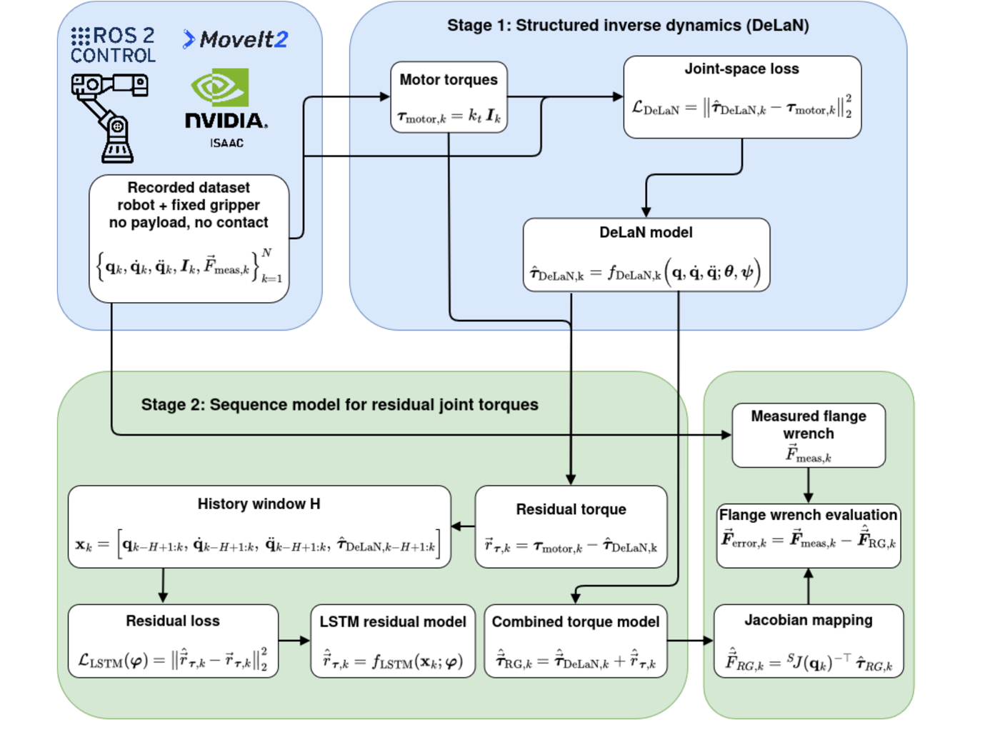
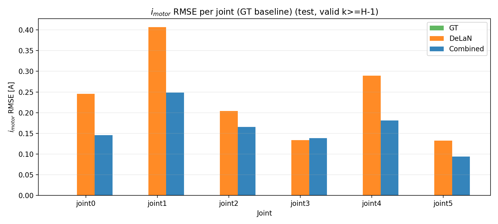
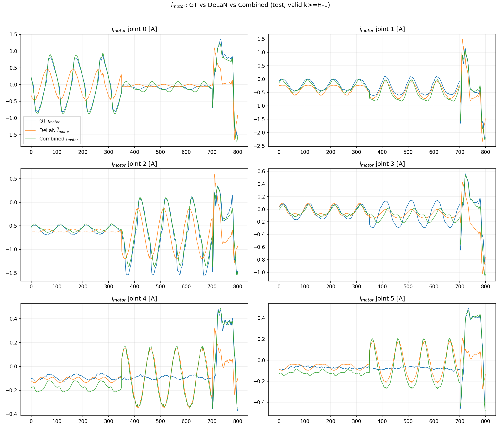

# Algorithmic Payload Estimation — Physics-Informed Inverse Dynamics (Master's Thesis)

This branch (`ros2`) is the implementation behind the master's thesis **"Physics-Informed Inverse Robot Dynamics with Residual LSTM Modeling"** (FH Technikum Wien, Robotics Engineering, 2026). It learns to predict a collaborative robot's per-joint motor currents from joint kinematics alone, combining a physics-structured Deep Lagrangian Network (DeLaN) with a learned LSTM residual, and benchmarks the result against a published linear system-identification baseline.

The full thesis is in [`docs/latex-module`](docs/latex-module) (submodule; built PDF at `docs/latex-module/build/APE.pdf`).

> The `main` branch of this repo holds a different, related project ("Gaussian Process-Based 6D Wrench Estimation"). This README covers the `ros2` branch only.

## The problem

Safe collaborative manipulation requires a robot to know its own dynamics well enough to notice when something changes — a payload picked up, an unexpected contact. The only sensors reliably available during normal operation are joint encoders and motor currents (no joint-torque or force/torque sensor). This thesis asks: **how accurately can per-joint motor current be predicted from joint position, velocity, and acceleration alone**, using a model structured enough to stay physically meaningful, while still capturing effects (friction, backlash, drivetrain non-idealities) that a pure rigid-body model misses?

## Approach: a two-stage pipeline

**Stage 1 — DeLaN (physics-structured baseline).** A Deep Lagrangian Network learns a configuration-dependent inertia matrix and potential energy term, and derives the inverse-dynamics torque/current prediction through the Euler-Lagrange equations. This guarantees a positive-definite inertia matrix and physically consistent conservative dynamics by construction, trained only on joint states and motor currents — no force/torque sensor needed.

**Stage 2 — LSTM residual.** The DeLaN model is frozen, and an LSTM is trained on the *residual* between measured motor current and the DeLaN prediction, using a sliding window of past joint states and DeLaN predictions. This captures history-dependent effects (friction, backlash) that a purely instantaneous physics model cannot represent.

The combined prediction is simply `î_comb = î_DeLaN + r̂` (frozen DeLaN output plus the learned residual correction).


*(See Figure 5 in the thesis for the full diagram — Stage 1 trains DeLaN on joint-space data and regresses motor currents; Stage 2 trains an LSTM on DeLaN's residual error over a fixed history window.)*

## Results

Evaluated on the public ["Dataset of Collaborative Robots for Energy Consumption Modeling"](https://ieee-dataport.org/) (UR3e and UR10e, with and without an attached payload), benchmarked at the dataset's own scale (50,000 training / 5,000 held-out test samples per condition) against the dataset's published linear-regressor baseline.

**Per-joint motor-current RMSE, UR3e without load** — DeLaN alone vs. the combined DeLaN+LSTM predictor:



The LSTM residual reduces RMSE on every joint relative to DeLaN alone (joint 1, the shoulder-lift and most load-bearing joint, sees the largest absolute reduction). Representative current traces over a held-out trajectory, ground truth vs. DeLaN vs. combined:



**Comparison to the dataset's published baseline** (overall RMSE in amps, lower is better):

| Condition | Baseline [21] | DeLaN (ours) | DeLaN+LSTM (ours) |
|---|---|---|---|
| UR3e, no load | **0.10** | 0.43 | 0.25 |
| UR3e, with load (hammer, 1.5 kg) | 0.21 | 0.43 | **0.09** |
| UR10e, no load | 0.33 | 1.15 | **0.27** |

The pattern that emerges: the baseline's simple linear regressor is hard to beat on the small, unloaded UR3e, where its parametric structure is already a good fit. Once a payload is added or the robot gets larger (UR10e), the physics-informed DeLaN+LSTM pipeline pulls ahead — the added mechanical complexity is exactly where a purely linear model starts to struggle and where the physics-structured + learned-residual approach pays off. See Chapter 5 of the thesis for the complete set of results, including the trajectory-count ("K-domination") sensitivity study and the full hyperparameter ablations.

## Repository layout

```
payload_estimation/        # the actual pipeline (git submodule) — start here to run anything
  docker-compose.yml        # preprocess -> delan_jax -> lstm -> evaluation (+ a Streamlit runner_gui)
  services/
    preprocess/              # raw IEEE DataPort CSV logs -> trajectory-wise, filtered .npz
    delan/                   # Stage 1: DeLaN training (JAX/Haiku+Optax)
    lstm/                    # Stage 2: residual LSTM training (TensorFlow)
    evaluation/               # combines both models, maps through the Jacobian, reports RMSE + plots
    sweep/                   # orchestrates the K-domination and best-model hyperparameter sweeps
    runner_gui/               # Streamlit front-end for the stack
  shared/                    # data/models/evaluation outputs, shared between services via bind mounts
  scripts/                   # up_stack.sh, run_sweep*.sh convenience wrappers

deep_lagrangian_networks/   # upstream DeLaN reference implementation (git submodule), used as the Stage 1 codebase
docs/latex-module/          # the thesis itself (git submodule)

# ROS 2 / simulation side (used for the robot description and MoveIt-based visualization,
# see Fig. 5 in the thesis; not required to reproduce the training results above):
Universal_Robots_ROS2_Description/
Universal_Robots_ROS2_Driver/
manipulator_description/
manipulator_moveit_config/
rbyt_robotiq/
IsaacLab/
isaac_ros_ws/
```

## Running it

The pipeline runs as a `docker compose` stack of four services (preprocess → DeLaN → LSTM → evaluation), each in its own container, sharing data through bind-mounted host folders under `payload_estimation/shared/`. Stage 1 (DeLaN) and Stage 2 (LSTM) need an NVIDIA GPU (`gpus: all` in the compose file).

```bash
cd payload_estimation   # clone of this repo, on the ros2 branch

# 1. Create your own .env (gitignored) pointing at this checkout.
#    APE_REPO should be the path to the top-level algorithmic_payload_estimation clone.
cat > .env <<'EOF'
APE_REPO=/path/to/algorithmic_payload_estimation
APE_PE=${APE_REPO}/payload_estimation
APE_DELAN=${APE_REPO}/deep_lagrangian_networks
APE_PREPROCESS=${APE_PE}/services/preprocess
APE_EVALUATION=${APE_PE}/services/evaluation
LSTM=${APE_PE}/services/lstm
APE_SHARED=${APE_PE}/shared
UID=1000
GID=1000
DISPLAY=:0
EOF

# 2. Bring the stack up (builds images on first run)
./scripts/up_stack.sh up          # add "log" / "log <service>" to also stream logs
./scripts/up_stack.sh status
./scripts/up_stack.sh down

# 3. Run the experiments described in the thesis (K-domination sweep, best-model
#    selection for DeLaN and for the LSTM residual):
./scripts/run_sweep.sh
./scripts/run_sweep_best_delan.sh
./scripts/run_sweep_best_lstm.sh
```

See [`payload_estimation/README.md`](payload_estimation/README.md) for the full service-by-service breakdown (what each container mounts, produces, and depends on).

## Implementation notes

- **Dataset**: [IEEE DataPort — Dataset of Collaborative Robots for Energy Consumption Modeling](https://ieee-dataport.org/), UR3e and UR10e, sinusoidal joint-space excitation trajectories at 100 Hz, with and without an attached payload (hammer 1.5 kg / RobotiQ 2F-85 gripper 1 kg).
- **Preprocessing**: 4th-order zero-phase Butterworth low-pass filter (10 Hz cutoff) applied per trajectory before deriving accelerations; train/validation/test splits are made at the trajectory level (never within a trajectory) to avoid leakage.
- **DeLaN**: trained on a trigonometric joint-angle feature map (`[q, sin(q), cos(q)]`), with per-joint loss normalization so no single joint's torque magnitude dominates training.
- **LSTM residual**: two stacked LSTM layers (128 units), trained on standardized, windowed sequences of joint state + DeLaN prediction; history length and input feature mode were swept and selected via a robustness-aware validation score (median + IQR across dataset/model seeds, penalizing divergence) rather than picking the single best validation run.
- **All reported quantities are motor current in amps** (not torque) — the dataset provides current but not joint-torque ground truth, so the thesis formulates everything in the measured actuation domain and notes the constant torque-current conversion factor where relevant, without applying it.
