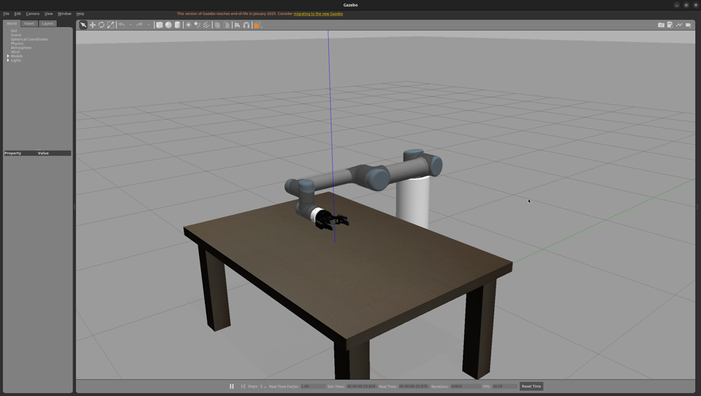
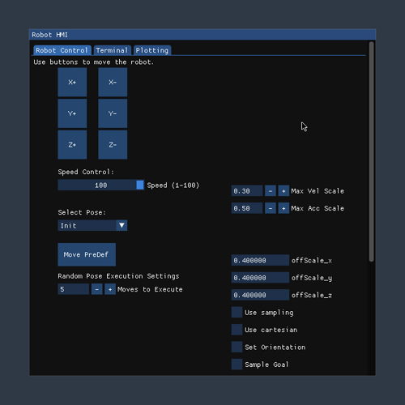
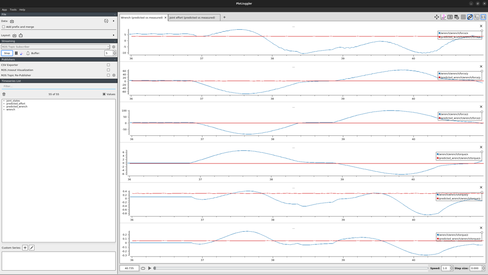
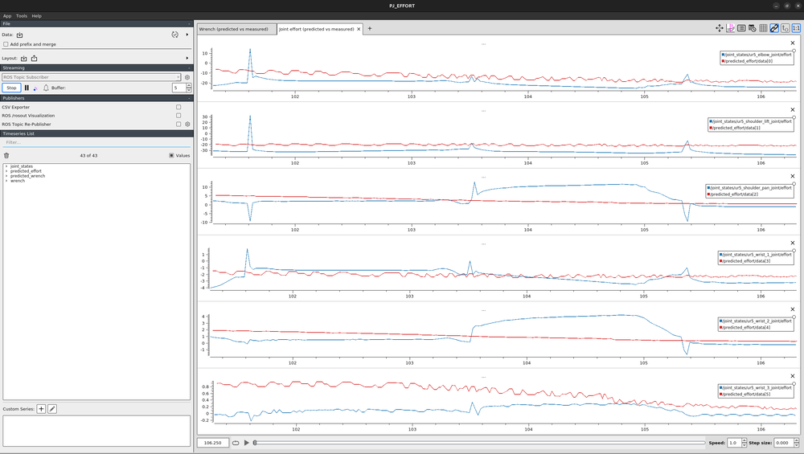

# Algorithmic Payload Estimation (UR5, Gazebo)

This branch (`main`) implements **"Algorithmic Payload Internal Parameter Estimation with a Simulated UR5 Robot"** — a coursework project (one module's exam submission in the Robotics Engineering master's program at FH Technikum Wien; **not peer-reviewed**). The write-up is in [`docs/Algorithmic_Payload_Estimation.pdf`](docs/Algorithmic_Payload_Estimation.pdf).

> The `ros2` branch of this repo holds a different, unrelated project (a master's thesis on physics-informed inverse dynamics). This README covers `main` only.

## The idea

A UR5 in Gazebo carries a gripper (always attached) and, optionally, a payload. The goal is to estimate the payload's mass and inertia by isolating its contribution to the force/torque (F/T) sensor mounted between the flange and the gripper — separating the gripper's own (constant) contribution from the payload's (variable) one.



The approach: train two Gaussian Process (GP) models on joint-state data recorded while the robot moves with the gripper only (no payload), then use them to predict, live, what the F/T sensor *should* read if there were still no payload:
- **GP_effort**: predicts the 6 joint motor efforts from joint positions and velocities.
- **GP_wrench**: predicts the 6D F/T sensor wrench (force + torque) from joint positions, velocities, and the *predicted* effort (chained after GP_effort).

If a payload is later attached, the gap between this "no-payload" prediction and the actual measured wrench is attributable to the payload — in principle usable for mass/inertia identification via the Newton-Euler equations (see the paper for the derivation). This repo implements and evaluates the two GP models; it does not go on to fit the payload's inertial parameters from the residual.

**Result from the paper, important to repeat here**: both GP models reach good accuracy on held-out *test splits* of the recorded data (effort R² ≈ 0.9, wrench R² ≈ 0.85–0.9), but perform poorly in *live* prediction during a new trajectory — R² on live wrench prediction is frequently negative, meaning the model does worse than just predicting the mean. The paper's own conclusion: *"even models representing a very broad dataset cannot estimate the payload accurately"* in the live setting. Running the setup below reproduces this directly — in PlotJuggler, the predicted wrench visibly fails to track the oscillating measured wrench, while the predicted effort tracks reasonably well.

## Repository layout

```
manipulator_description/     # UR5 + gripper URDF/xacro, Gazebo launch
manipulator_moveit_config/   # MoveIt config for planning
hmi/                         # Custom ImGui/ImPlot control panel (see below)
payload_estimation/          # The actual GP pipeline — data, training, prediction, plots
  data/
    raw/rosbag/, raw/csv/      # Recorded trajectories (rosbag + exported CSV)
    processed/effort/, wrench/ # Preprocessed, standardized train/test CSVs + scalers
    result/                    # Plots and metrics from the paper's offline evaluation
  gp_models/                 # Trained GPy models (.pkl) + their scalers
  plotjuggler/                # Pre-built layout for the predicted-vs-measured overlay
  scripts/
    data_preperation/          # rosbag -> CSV, CSV -> standardized train/test splits
    training/                  # gp_training_node.py: trains GP_effort or GP_wrench
    prediction/                # gp_ft_estimate_node.py: live GP_effort -> GP_wrench inference
    plots/                     # live_*_plot.py: matplotlib-based live plotting (alternative to PlotJuggler)
  include/, src/               # ft_extractor: time-synchronizes measured vs. predicted wrench, publishes the difference
docker/                     # Dockerfile.simulation + docker-compose.yaml
docs/                       # The paper (PDF) and a robot dimensions reference image
universal_robot/, robotiq/  # Robot/gripper description submodules
```

## The `hmi` control panel

`hmi` is a custom ImGui/ImPlot application (not RViz/rqt) that drives the robot via MoveIt's `move_group` interface. It's how the training trajectories were generated: it can execute random or predefined Cartesian motions (sampling target poses from a cube centered on the TCP, per the paper's data-collection protocol), move along a plane, or control the gripper. It's launched automatically alongside Gazebo.



## Setup

```bash
git clone git@github.com:Roblyat/algorithmic_payload_estimation.git
cd algorithmic_payload_estimation
git checkout main
git submodule update --init --recursive

xhost +local:docker
cd docker
docker compose up --build -d
```

```bash
docker exec -it force_estimation_container bash
source /opt/ros/noetic/setup.bash
cd /catkin_ws && catkin_make
source devel/setup.bash
roslaunch manipulator_description manipulator_gazebo.launch
```

This starts Gazebo, RViz with the MoveIt motion planning plugin, and the `hmi` control panel.

> `LIBGL_ALWAYS_SOFTWARE=1` is set in `docker-compose.yaml` so Gazebo/RViz fall back to software OpenGL when no GPU is passed through to the container. If you do have GPU passthrough configured, you can remove it. If the 3D views render as a black window after `docker compose up`, a full `docker compose restart` (not just relaunching the ROS nodes) has reliably fixed this — it appears to be a stale GL context from container startup rather than anything wrong with the simulation itself, which keeps publishing `/joint_states` and `/wrench` normally either way.

### Running the GP prediction live

Trained models for both GP_effort and GP_wrench are already included under `payload_estimation/gp_models/` (sparse GP, trained on the recorded `cartesian.bag` trajectory data). To run live prediction against the simulation:

```bash
# in a new shell into the same container:
docker exec -it force_estimation_container bash
source /opt/ros/noetic/setup.bash
rosparam set /rosparam/rosbag_name 'cartesian.bag'
rosparam set /rosparam/data_type 'wrench'
rosparam set /rosparam/use_sparse true
rosparam set /rosparam/use_kfold false
cd /catkin_ws/src/algorithmic_payload_estimation/payload_estimation
python3 scripts/prediction/gp_ft_estimate_node.py
```

This subscribes to `/joint_states` and publishes `/predicted_effort` (`std_msgs/Float64MultiArray`, 6 values matching `ur5_elbow_joint, ur5_shoulder_lift_joint, ur5_shoulder_pan_joint, ur5_wrist_1_joint, ur5_wrist_2_joint, ur5_wrist_3_joint`) and `/predicted_wrench` (`geometry_msgs/WrenchStamped`). Drive the robot via the `hmi` panel (or `hmi`'s random/Cartesian execution) to see live predictions against the simulated ground truth.

### Visualizing predicted vs. measured in PlotJuggler

```bash
docker exec -it force_estimation_container bash
source /opt/ros/noetic/setup.bash
/opt/ros/noetic/lib/plotjuggler/plotjuggler \
  -l /catkin_ws/src/algorithmic_payload_estimation/payload_estimation/plotjuggler/predicted_vs_measured.xml \
  --start_streamer "ROS Topic Subscriber"
```

This loads a pre-built layout with two tabs, each overlaying measured (blue) against predicted (red) curves:
- **Wrench** — `/wrench` vs. `/predicted_wrench`, all 6 channels (Fx, Fy, Fz, Tx, Ty, Tz).
- **Joint effort** — `/joint_states/effort` (UR5 joints only, indices 7–12 in the message's joint array) vs. `/predicted_effort`, all 6 joints.





This is the live-prediction failure mode from the paper, visible directly: the measured wrench (blue) swings through the robot's actual motion while the predicted wrench (red) stays nearly flat, barely reacting.

If you'd rather build the view yourself: open PlotJuggler, set the streaming source to "ROS Topic Subscriber" and hit Start, then drag the topics above onto the plot area.

An alternative to PlotJuggler: `payload_estimation/scripts/plots/live_wrench_plot.py`, `live_effort_plot.py`, and `live_wrench_error_plot.py` give the same comparison as live-updating matplotlib windows, and `ft_extractor` (a C++ node, built as part of the catkin workspace) time-synchronizes `/wrench` and `/predicted_wrench` and publishes their difference directly as a topic/logged file.

### Retraining a GP model

```bash
rosparam set /rosparam/rosbag_name 'cartesian.bag'
rosparam set /rosparam/data_type 'wrench'   # or 'effort'
rosparam set /rosparam/use_sparse true      # sparse GP (required for datasets of this size; full GP is O(n^3))
cd /catkin_ws/src/algorithmic_payload_estimation/payload_estimation
python3 scripts/data_preperation/csv_preprocess_wrench_data.py   # or csv_preprocess_effort_data.py
python3 scripts/training/gp_training_node.py
```
Sparse GP training with 500 inducing points on ~12k samples takes roughly 10 minutes on a modern multi-core CPU (GPy's `optimize()` runs until its own convergence criterion, not a fixed time).

## Known limitations (from the paper)

- **Live prediction is unreliable**, especially for the wrench model — the paper's own discussion attributes this to the GP's inability to capture the joint states' multivariate distribution well enough to generalize off the training manifold. This is a negative result worth keeping, not a bug to fix.
- Only the **effort** GP model shipped trained in this repo originally; the **wrench** model was retrained from the existing recorded data as part of setting up this README (same recording, same preprocessing pipeline as the paper).
- Several scripts (e.g. the Dockerfile's bind-mounted workspace path) assumed a specific developer machine; the `docker-compose.yaml` volume mount has been made relative (`..`) so the repo runs from any clone location.
