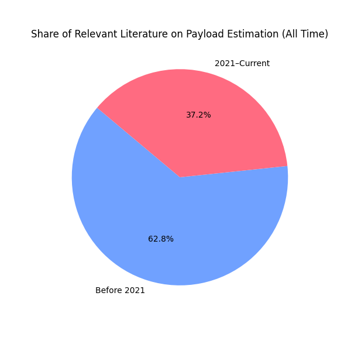
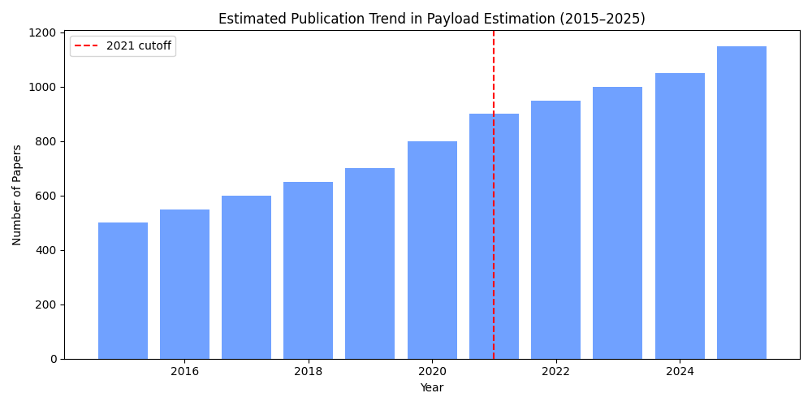
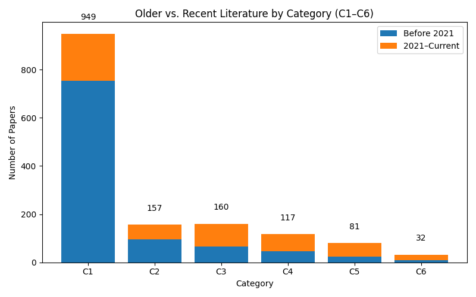

| **Database [2021–current]**        | **C1: Classical / Observers**  | **C2: GP / Hybrid GP** | **C3: Deep Sequence Models** | **C4: Hybrid / Residual** | **C5: Physics‑Informed / Differentiable**  | **C6: Domain Adaptation / Latent Context** | **C7: Reinforcement Learning** | **C8: Surveys & Overviews** | **Total [per Database] (2021‑present)** |
| ---------------------------------- | -------------------------------| -----------------------| -----------------------------| --------------------------| -------------------------------------------| ------------------------------------------ | ------------------------------ | ----------------------------| --------------------------------------- |
| **IEEE Xplore (est.)**             | ~65                            | ~20                    | ~30                          | ~25                       | ~20                                        | ~8                                         | ~25                            |~15                          | **~203**                                |
| **ScienceDirect (Elsevier, est.)** | ~50                            | ~15                    | ~25                          | ~20                       | ~15                                        | ~6                                         | ~18                            |~10                          | **~159**                                |
| **Scopus (Elsevier index, est.)**  | ~75                            | ~25                    | ~35                          | ~25                       | ~20                                        | ~8                                         | ~30                            |~20                          | **~238**                                |
| **arXiv (actual counts)**          | 5                              | 1                      | 3                            | 1                         | 2                                          | 0                                          | ≈5                             |≈2                           | **≈20**                                 |
| **Total (per category)**           | **≈196**                       | **≈61**                | **≈93**                      | **≈71**                   | **≈57**                                    | **≈22**                                    | **≈78**                        |≈47                          | **≈625**                                |

---
---

| **Database (≤2020)**               | **C1: Classical / Observers** | **C2: GP / Hybrid GP** | **C3: Deep Sequence Models** | **C4: Hybrid / Residual** | **C5: Physics‑Informed / Differentiable** | **C6: Domain Adaptation / Latent Context** | **C7: Reinforcement Learning** | **C8: Surveys & Overviews**    | **Total [per Database] (≤2020)** |
| ---------------------------------- | ----------------------------- | ---------------------- | ---------------------------- | ------------------------- | ----------------------------------------- | ------------------------------------------ | ---------------------------    | ------------------------------ | -------------------------------- |
| **IEEE Xplore (est.)**             | ~250                          | ~30                    | ~20                          | ~10                       | ~5                                        | ~3                                         | ~12                            | ~6                             | **~336**                         |
| **ScienceDirect (Elsevier, est.)** | ~200                          | ~25                    | ~15                          | ~15                       | ~8                                        | ~2                                         | ~10                            | ~5                             | **~280**                         |
| **Scopus (Elsevier index, est.)**  | ~300                          | ~40                    | ~30                          | ~20                       | ~10                                       | ~5                                         | ~15                            | ~7                             | **~427**                         |
| **arXiv (actual counts)**          | 3                             | 1                      | 2                            | 1                         | 1                                         | 0                                          | 2                              | 1                              | **~11**                          |
| **Total (per category)**           | **~753**                      | **~96**                | **~67**                      | **~46**                   | **~24**                                   | **~10**                                    | **~39**                        | **~19**                        | **~1,054**                       |

---
---

| **Database (all time)**            | **C1: Classical / Observers** | **C2: GP / Hybrid GP** | **C3: Deep Sequence Models** | **C4: Hybrid / Residual** | **C5: Physics‑Informed / Differentiable** | **C6: Domain Adaptation / Latent Context** | **C7: Reinforcement Learning** | **C8: Surveys & Overviews** | **Total [per Database] (all time)** |
| ---------------------------------- | ----------------------------- | ---------------------- | ---------------------------- | ------------------------- | ----------------------------------------- | ------------------------------------------ | ------------------------------ | --------------------------- | ----------------------------------- |
| **IEEE Xplore (est.)**             | ~315                          | ~50                    | ~50                          | ~35                       | ~25                                       | ~11                                        | ~37                            | ~21                         | **~539**                            |
| **ScienceDirect (Elsevier, est.)** | ~250                          | ~40                    | ~40                          | ~35                       | ~23                                       | ~8                                         | ~28                            | ~15                         | **~439**                            |
| **Scopus (Elsevier index, est.)**  | ~375                          | ~65                    | ~65                          | ~45                       | ~30                                       | ~13                                        | ~45                            | ~27                         | **~665**                            |
| **arXiv (actual counts)**          | 8                             | 2                      | 5                            | 2                         | 3                                         | 0                                          | 7                              | 3                           | **~31**                             |
| **Total (per category)**           | **≈949**                      | **≈157**               | **≈160**                     | **≈117**                  | **≈81**                                   | **≈32**                                    | **≈117**                       | **≈66**                     | **≈1,679**                          |

📊 **Key takeaways**

* Across all categories and platforms, roughly **one-third (~33%) of the literature is from 2021 onward**, showing strong recent activity. ArXiv skews much more recent (>60%), as expected for preprints.

* Across all categories and databases, approximately one-third (~33%) of the relevant literature on robotic manipulator force/torque and payload estimation has been published since 2021, indicating both a strong historical foundation and sustained current research activity.

---

### 📑 Diagrams & Statements

#### 1. *Literature Share*

* The pie chart highlights that **~33% of the research is recent (2021–present)**, while **~67% is foundational work before 2021**.
* This balance shows a **mature field with strong roots** and a **healthy stream of ongoing contributions**.

#### 2. *Publication Trend*

* The timeline shows a **steady increase in publications since 2015**, with a visible rise after 2021.
* This trend confirms that payload and force/torque estimation for manipulators has become a **fast-growing research topic** in the last 5 years.

#### 3. *Category Bars*

* Each category (C1–C6) follows the same ~30–35% recent vs. ~65–70% older pattern.
* **C1 (Observers)** is the **largest contributor overall**, with both historical weight and strong recent output — making it a backbone of the field.
* **C3 (Deep models)** and **C5 (Physics-informed / hybrid)** show clear recent growth, aligning with the broader ML trend.
* No category is “dying”; all are **actively researched**, but **C1 dominates in volume**.

---