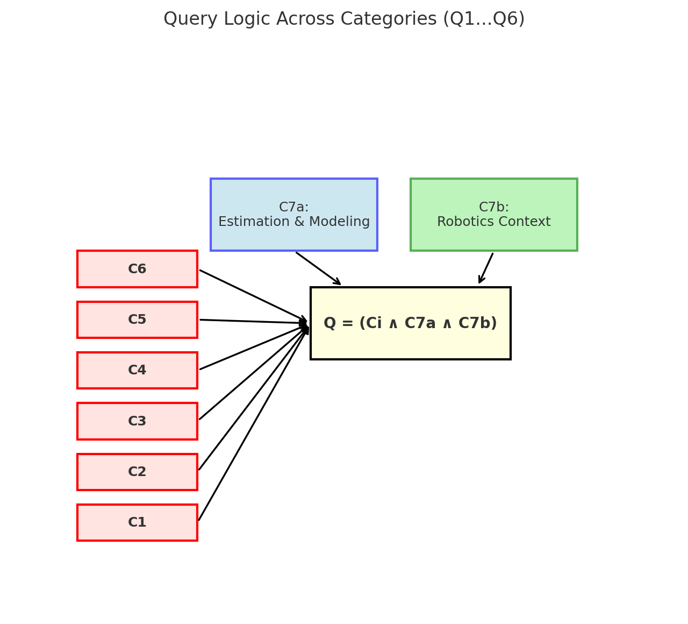
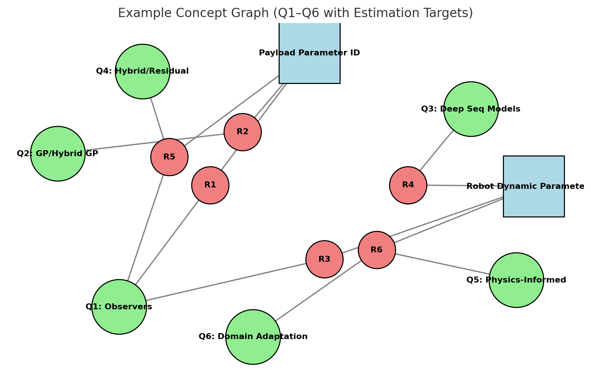

---
# Scientific Contribution

## Table of Contents
0. [What we need to do first](#0-what-we-need-to-do-first)
1. [What is on the market](#1-what-is-on-the-market)
2. [Questions](#2-questions)
3. [Important things we need to remember](#3-important-things-we-need-to-remember)
---

## 1) What is on the market / SIGNIFICANT PAPER

- CHECK THESE PAPER RELATED WORK --> that finishes research

**Accurate Payload Dynamics Estimation and Compensation of a Robotic Manipulator without External Motion Measuring Sensors [2025]**  
https://doi-1org-100033c7611df.han.technikum-wien.at/10.1109/EECR64516.2025.11077346

- Classical methods just work as long as payload is manipulated 
- Force sensor gets damaged by contact with environment
- Good SOTA 2025 and classification in SOTA
- Good mathematics

**An adaptive sparse general regression neural network-based force observer for teleoperation system [2023]**  
https://doi-1org-1000340761202.han.technikum-wien.at/10.1016/j.engappai.2022.105689

- NN SOTA
- Okay mathematics
- No robot dynamics

**On the Fully Decoupled Rigid-Body Dynamics Identification of Serial Industrial Robots** [2025]
https://ieeexplore-1ieee-1org-100033c761aa6.han.technikum-wien.at/document/11029106

- good mathmatics
- current sota kalman filter classical observers
---

## 2) Questions

- What about these observers (classical model-based observer methods)? Why can't they work without accurate model dynamics?
    - Disturbance observer
    - Dynamic state observer
    - Momentum-based observer

- How does the best mathematical expression for my problem look?

---

## 3) Important things we need to remember

- We want to eliminate the need for the dynamic parameters of the robot

## 4) Index Term Pool

Perfect — let’s make this clean. I’ll add a **new category: “Estimation Goal & Domain”** that contains only unique, well-scoped search terms. I’ll also keep capitalization consistent so you can copy them directly into searches.

---

## 5) 🔑 Categories with Keywords

## **1. Classical / Observers**

* momentum observer (MO)
* generalized momentum observer (GMO)
* disturbance observer (DOB)
* reaction force observer (RFOB)
* Kalman filter (KF)
* extended Kalman filter (EKF)
* unscented Kalman filter (UKF)
* state observer
* least squares (LS)
* weighted least squares (WLS)
* iterative reweighted least squares (IRLS)
* recursive least squares (RLS)
* momentum-based observer
* dynamic state observer
* observer
* force observer
* torque observer

 
## **2. Gaussian Process (GP) / Hybrid GP**

* gaussian process regression (GPR)
* sparse gaussian process (SGP, SGPR)
* multi-output gaussian process (MOGP)
* multi-task gaussian process (MTGP)
* gaussian process state space model (GPSSM)
* hybrid gaussian process
* GP residual
* gaussian process dynamics
* GP inverse dynamics
* bayesian nonparametric regression (BNPR)

## **3. Deep Sequence Models (MLP / GRU / TCN / Transformer)**

* neural network inverse dynamics (NN-ID)
* deep learning
* multi layer perceptron (MLP)
* residual network (ResNet)
* long short-term memory (LSTM)
* gated recurrent unit (GRU)
* temporal convolutional network (TCN)
* causal convolution
* dilated convolution
* transformer model
* attention model
* sequence-to-sequence (seq2seq, S2S)
* sequence GAN (SeqGAN, TimeGAN)
* GAN
* Generative Adversarial Networks

## **4. Hybrid / Residual**

* residual learning dynamics
* residual neural network (ResNN)
* hybrid model dynamics
* analytical dynamics neural network (ADNN)
* physics residual
* rigid body dynamics residual (RBD residual)
* Newton Euler residual (NE residual)
* nominal dynamics model (NDM)
* neural correction
* learning inverse dynamics residual (ID residual)
* residual GAN
* GAN
* Generative Adversarial Networks

## **5. Physics-Informed / Differentiable**

* physics-informed neural network (PINN)
* differentiable physics
* differentiable simulation (DiffSim)
* differentiable robot model
* differentiable dynamics
* neural ODE (NODE)
* torchdiffeq
* ODE-net
* Isaac Gym differentiable
* Isaac Lab differentiable
* physics-guided machine learning robotics (PGML)

## **6. Domain Adaptation / Latent Context**

* domain adaptation (DA)
* transfer learning (TL)
* meta learning (ML)
* context variable dynamics
* latent variable model (LVM)
* amortized inference (AI)
* test time adaptation (TTA)
* online adaptation (OA)
* feature invariance
* domain invariant features (DIF)
* few shot learning (FSL)
* zero shot transfer (ZSL)

## **7. (Estimation Goal & Domain)**
## **7a. Estimation & Modeling Terms**

* external force
* force measurement
* force estimation
* force/torque estimation
* wrench estimation
* joint torque estimation
* end-effector force
* end-effector torque
* inertial parameters
* inertial parameter identification (IPI)
* online payload identification
* payload identification
* payload estimation
* object parameter estimation
* parameter identification
* inertia tensor
* inertia tensor estimation
* center of mass (CoM)
* rigid body dynamics
* nonlinear systems
* friction approximation
* nonlinear friction model
* external perturbations
* force torque sensor (F/T sensor)
* noise
* signal noise
* noise estimation
* external force estimation (EFE)
* external torque estimation (ETE)
* torque estimation
* parameter identification differentiable simulation
* payload identification (PI)
* payload estimation (PE)
* contact force

## **7b. Robotics Context Terms**

* robotic manipulator
* robotic arm
* robotic manipulation
* robot payload

---
---

## 8) 🔎 Research Results

### Categories
- $C_1 =$ Classical / Observers
- $C_2 =$ Gaussian Process (GP) / Hybrid GP
- $C_3 =$ Deep Sequence Models (MLP / GRU / TCN / Transformer)
- $C_4 =$ Hybrid / Residual  
- $C_5 =$ Physics-Informed / Differentiable  
- $C_6 =$ Domain Adaptation / Latent Context  

### Query Logic (Generalized Set Intersection)

### Combined Representation

$$
C = \{ C_1, C_2, \dots, C_6 \}
$$

$$
Q = \bigcup_{i=1}^{6} Q_i
$$

$$
Q_i = \left( \bigvee_{c \in C_i} c \right) 
\;\; \land \;\; 
\left( \bigvee_{e \in C7a} e \right) 
\;\; \land \;\; 
\left( \bigvee_{r \in C7b} r \right),
\quad i = 1, 2, \dots, 6
$$

---

## 📊 Research Results Table

| Query   | Total Papers | Papers (2022–Current)  | Mature SoA [2022-2025]|
|---------|--------------|------------------------|-----------------------|
| $Q_1$   |     462      |          152           |           10          |
| $Q_2$   |      21      |            8           |           3           |
| $Q_3$   |     167      |          119           |           8           |
| $Q_4$   |      23      |           19           |           4           |
| $Q_5$   |       2      |            2           |           1           |
| $Q_6$   |      41      |           27           |           9           |
| $Total$ incorrect |     $705$    |          $315$         |          $23$         |

## Filter relevant impact State of Art
* **“Mature SoA”** = cited or relevant work. paper with impact for ape [2022-2025]
---
---

## Concept Graph

- **category size depends on how much paper related to it**
- **esitmation/modeling terms and robotics contend size depents on how much paper related to it**
- **reference bubbls size with their amount of citation (maybe in combination with the relese date), showing the impact of each reference**

---

